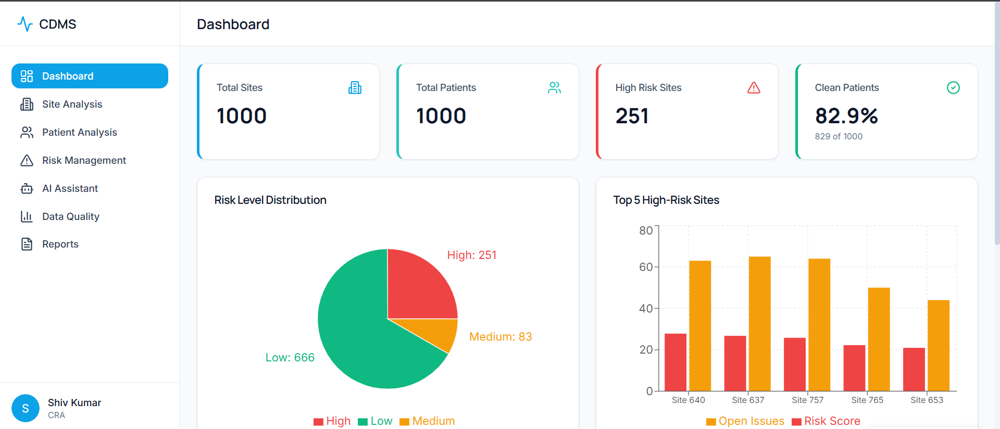

# 🧬Clinical Data Monitoring System - Complete Setup Guide 🩺

## Overview
A comprehensive Clinical Data Monitoring System with **Supabase** for clinical data storage and **Firebase Authentication** for secure user access.

## Register/Login Page



## Dashboard

## Sites Risk Analysis

## Patient Analysis

## AI Agents

## Data Quality Analysis

## Generate Reports


## ✅ What's Already Configured

### 1. Supabase Integration
- **URL**: `https://qlavibrdivegeecqzxzn.supabase.co`
- **Key**: Configured in environment variables
- **Tables**: Expects 3 tables with specific names:
  - `High Risk Sites`
  - `Patient Data`
  - `Sites Data`

### 2. Backend & AI
- FastAPI backend with JWT and Firebase auth support
- OpenAI GPT-5.2 integration (Emergent Universal Key configured)
- MongoDB for user profiles, alerts, comments, tags

### 3. Frontend
- React 19 with professional medical design
- Firebase SDK installed
- Hybrid authentication (JWT fallback + Firebase)

## 🔧 Setup Instructions

### Step 1: Configure Firebase (REQUIRED for Authentication)

#### 1.1 Create Firebase Project
1. Go to [Firebase Console](https://console.firebase.google.com/)
2. Click "Add project"
3. Enter project name: `clinical-data-monitoring`
4. Disable Google Analytics (optional)
5. Click "Create project"

#### 1.2 Enable Email/Password Authentication
1. In Firebase Console, go to **Authentication** → **Sign-in method**
2. Click on **Email/Password**
3. Toggle **Enable** and click **Save**

#### 1.3 Get Frontend Configuration Keys
1. Go to **Project Settings** (gear icon) → **General**
2. Scroll to "Your apps" section
3. Click on **Web** icon (</>)
4. Register app name: `clinical-monitoring-web`
5. Copy the configuration object

#### 1.4 Update Frontend Environment Variables

Edit `/app/frontend/.env` and replace the Firebase placeholders:

```bash
REACT_APP_FIREBASE_API_KEY=AIzaSy...your-actual-key
REACT_APP_FIREBASE_AUTH_DOMAIN=your-project-id.firebaseapp.com
REACT_APP_FIREBASE_PROJECT_ID=your-project-id
REACT_APP_FIREBASE_STORAGE_BUCKET=your-project-id.appspot.com
REACT_APP_FIREBASE_APP_ID=1:123456789:web:abcdef...
```

#### 1.5 Get Backend Service Account (Optional - For Advanced Features)
1. Go to **Project Settings** → **Service Accounts**
2. Click **Generate new private key**
3. Save as `/app/backend/firebase-admin.json`
4. Add to `/app/backend/.env`:
   ```bash
   FIREBASE_ADMIN_CONFIG_PATH=/app/backend/firebase-admin.json
   ```

**Note**: Without the service account, the system will still work with Firebase client-side auth but won't have admin verification.

#### 1.6 Restart Services
```bash
sudo supervisorctl restart backend frontend
```

### Step 2: Import Clinical Data to Supabase

#### 2.1 Access Supabase Dashboard
1. Go to [Supabase Dashboard](https://supabase.com/dashboard)
2. Select your project
3. Click on **Table Editor** in the left sidebar

#### 2.2 Create Tables

You need to create 3 tables with these exact names:

**Table 1: High Risk Sites**
```sql
CREATE TABLE "High Risk Sites" (
  "Study" TEXT,
  "Region" TEXT,
  "Country" TEXT,
  "Site_ID" TEXT,
  "Total_Subjects" INTEGER,
  "Total_Missing_Pages" INTEGER,
  "Total_Open_Issues" INTEGER,
  "Total_Uncoded_MedDRA" INTEGER,
  "Total_Uncoded_WHODD" INTEGER,
  "Total_Lab_Issues" INTEGER,
  "Avg_DQI" DOUBLE PRECISION,
  "Clean_Patients_Count" INTEGER,
  "Clean_Patient_Percentage" DOUBLE PRECISION,
  "Risk_Score" DOUBLE PRECISION,
  "Risk_Level" TEXT
);
```

**Table 2: Patient Data**
```sql
CREATE TABLE "Patient Data" (
  "Study" TEXT,
  "Region" TEXT,
  "Country" TEXT,
  "Site_ID" TEXT,
  "Subject_ID" TEXT,
  "missing_pages_count" INTEGER,
  "total_open_issues" INTEGER,
  "uncoded_meddra_terms" INTEGER,
  "uncoded_whodd_terms" INTEGER,
  "missing_lab_count" INTEGER,
  "Clean_Patient_Status" TEXT,
  "Data_Quality_Index" INTEGER
);
```

**Table 3: Sites Data**
```sql
CREATE TABLE "Sites Data" (
  "Study" TEXT,
  "Region" TEXT,
  "Country" TEXT,
  "Site_ID" TEXT,
  "Total_Subjects" INTEGER,
  "Total_Missing_Pages" INTEGER,
  "Total_Open_Issues" INTEGER,
  "Total_Uncoded_MedDRA" INTEGER,
  "Total_Uncoded_WHODD" INTEGER,
  "Total_Lab_Issues" INTEGER,
  "Avg_DQI" DOUBLE PRECISION,
  "Clean_Patients_Count" INTEGER,
  "Clean_Patient_Percentage" DOUBLE PRECISION,
  "Risk_Score" DOUBLE PRECISION,
  "Risk_Level" TEXT
);
```

#### 2.3 Import CSV Data

For each table:
1. Click on the table name in Table Editor
2. Click **Insert** → **Import data from CSV**
3. Upload your corresponding CSV file:
   - `Output_High_Risk_Sites.csv` → High Risk Sites
   - `Output_Patient_Level_Unified_CLEAN.csv` → Patient Data
   - `Output_Site_Level_Summary.csv` → Sites Data
4. Map columns correctly
5. Click **Import**

#### 2.4 Enable Row Level Security (Optional but Recommended)
```sql
ALTER TABLE "High Risk Sites" ENABLE ROW LEVEL SECURITY;
ALTER TABLE "Patient Data" ENABLE ROW LEVEL SECURITY;
ALTER TABLE "Sites Data" ENABLE ROW LEVEL SECURITY;

-- Allow authenticated users to read all data
CREATE POLICY "Allow authenticated users to read"
ON "High Risk Sites" FOR SELECT
USING (true);

-- Repeat for other tables
```

## 🚀 Using the Application

### 1. Access the Application
Navigate to: `http://localhost:3000` or your deployed URL

### 2. Register a New User
1. Click on the **Register** tab
2. Fill in:
   - Full Name: Your Name
   - Email: your.email@example.com
   - Password: (minimum 6 characters for Firebase)
   - Role: Choose from CRA, DQT, Site Staff, or Manager
3. Click **Create Account**

The app will automatically:
- Create Firebase authentication account
- Store user profile in MongoDB
- Log you in and redirect to dashboard

### 3. Features Available

#### Dashboard
- KPI cards (Total Sites, Patients, High Risk Sites, Clean Patient %)
- Risk distribution pie chart
- Top 5 high-risk sites bar chart
- Regional analysis

#### Site Analysis
- View all sites with risk levels
- Filter by risk level (High/Medium/Low)
- Search by Site ID, Country, or Region
- Add comments and tags

#### Patient Analysis
- View patient-level data quality
- Filter by clean status
- Search by Patient ID or Site ID
- DQI scoring

#### Risk Management
- View high-risk sites
- Create and manage alerts
- Resolve issues
- Priority-based tracking

#### AI Assistant
- Natural language queries about clinical data
- Generate automated reports (Site Performance, CRA, Risk Analysis)
- Get AI-powered action recommendations
- Uses OpenAI GPT-5.2

#### Data Quality
- Track open issues, missing pages, uncoded terms, lab issues
- DQI distribution analysis
- Sites requiring attention

#### Reports
- Export all data as CSV
- Filter by risk level or status
- Executive summary reports

## 🔍 Authentication Methods

The system supports **two authentication methods**:

### 1. Firebase Authentication (Recommended)
- When Firebase is configured in `.env`
- Provides secure, scalable authentication
- Automatic token refresh
- Better security features

### 2. JWT Authentication (Fallback)
- When Firebase is NOT configured
- Uses MongoDB for user storage
- Traditional JWT tokens
- Works without external dependencies

The system automatically detects which method is available and uses it.

## 🛠️ Troubleshooting

### Firebase Not Working
**Error**: "Firebase not configured"
**Solution**: 
1. Check that Firebase keys in `/app/frontend/.env` are correct
2. Verify keys don't have quotes or extra spaces
3. Restart frontend: `sudo supervisorctl restart frontend`

### Supabase Data Not Loading
**Error**: "Supabase not configured" or empty dashboard
**Solution**:
1. Verify tables exist with exact names: `High Risk Sites`, `Patient Data`, `Sites Data`
2. Check that CSV data was imported successfully
3. Verify RLS policies allow read access

### Authentication Token Errors
**Error**: "Invalid token" or "Token expired"
**Solution**:
1. Clear browser localStorage
2. Log out and log back in
3. Check backend logs: `tail -f /var/log/supervisor/backend.err.log`

### AI Features Not Working
**Solution**: 
- The Emergent LLM Key is already configured
- Check backend logs for API rate limits
- Verify internet connectivity for OpenAI API

## 📊 Data Structure

### Column Mappings

**High Risk Sites & Sites Data:**
- Study, Region, Country, Site_ID
- Total_Subjects, Total_Missing_Pages, Total_Open_Issues
- Total_Uncoded_MedDRA, Total_Uncoded_WHODD, Total_Lab_Issues
- Avg_DQI, Clean_Patients_Count, Clean_Patient_Percentage
- Risk_Score, Risk_Level

**Patient Data:**
- Study, Region, Country, Site_ID, Subject_ID
- missing_pages_count, total_open_issues
- uncoded_meddra_terms, uncoded_whodd_terms, missing_lab_count
- Clean_Patient_Status, Data_Quality_Index

## 🔐 Security Best Practices

1. **Never commit Firebase keys** to version control
2. **Enable RLS** on Supabase tables in production
3. **Use environment variables** for all sensitive data
4. **Rotate Firebase service account keys** periodically
5. **Monitor authentication logs** in Firebase Console

## 📞 Support

If you encounter issues:

1. **Check service status**: `sudo supervisorctl status`
2. **View logs**:
   - Backend: `tail -f /var/log/supervisor/backend.err.log`
   - Frontend: `tail -f /var/log/supervisor/frontend.err.log`
3. **Restart services**: `sudo supervisorctl restart backend frontend`

## 🎯 Next Steps

Once setup is complete:
1. Import your actual clinical trial data to Supabase
2. Invite team members (CRAs, DQT, Site Staff)
3. Configure alerts for high-risk indicators
4. Use AI Assistant for insights and reports
5. Set up regular data quality reviews

## 📝 Environment Variables Reference

### Frontend (`/app/frontend/.env`)
```bash
REACT_APP_BACKEND_URL=<your-backend-url>
REACT_APP_SUPABASE_URL=https://qlavibrdivegeecqzxzn.supabase.co
REACT_APP_SUPABASE_KEY=<your-supabase-key>
REACT_APP_FIREBASE_API_KEY=<your-firebase-api-key>
REACT_APP_FIREBASE_AUTH_DOMAIN=<project-id>.firebaseapp.com
REACT_APP_FIREBASE_PROJECT_ID=<your-project-id>
REACT_APP_FIREBASE_STORAGE_BUCKET=<project-id>.appspot.com
REACT_APP_FIREBASE_APP_ID=<your-app-id>
```

### Backend (`/app/backend/.env`)
```bash
MONGO_URL="mongodb://localhost:27017"
DB_NAME="test_database"
CORS_ORIGINS="*"
EMERGENT_LLM_KEY=<configured>
JWT_SECRET=<configured>
SUPABASE_URL=https://qlavibrdivegeecqzxzn.supabase.co
SUPABASE_KEY=<your-supabase-key>
FIREBASE_ADMIN_CONFIG_PATH=/app/backend/firebase-admin.json
```


